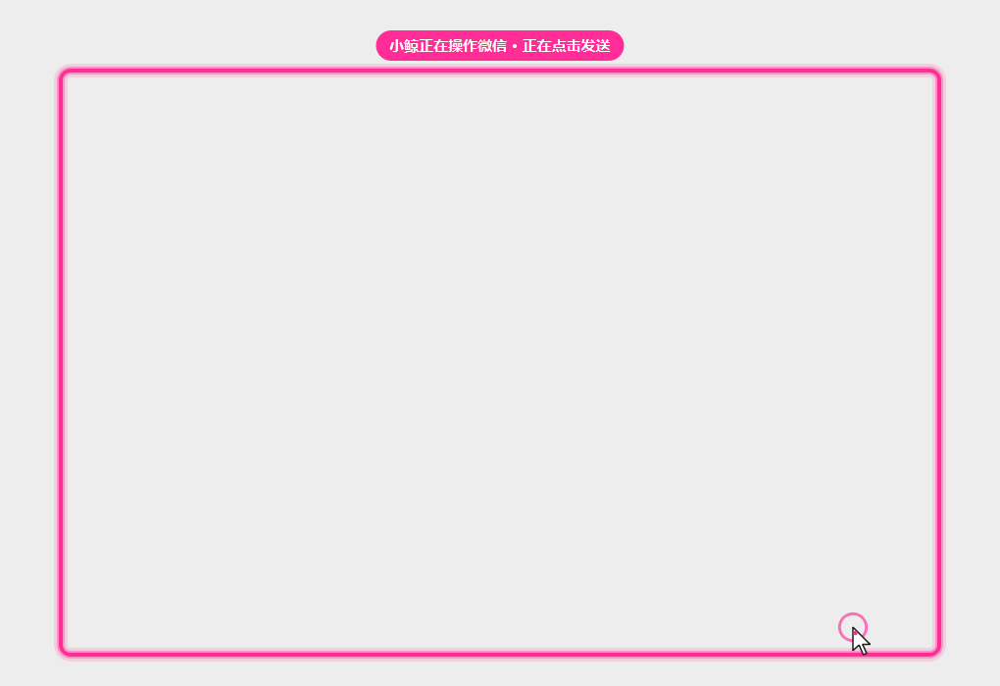

# xiaojing-wechat

小鲸销售助手的微信桌面客户端（PySide6）。它读取微信里备注含「顾客」的联系人发来的消息，调用后端生成回复，再把回复发回微信。

**发送不依赖任何大模型**：回复生成好之后，客户端按一套固定的点击步骤操作微信，每一步都有检查，任何一步不对就中止，不会发出去。

## 平台支持

| 功能 | Windows | macOS |
| --- | --- | --- |
| 运行客户端 `python -m app.main` | 支持 | 支持（未在真机验证） |
| 读取消息（内置 wechat-cli） | 支持 | 需要先提取数据库密钥，见下文 |
| 发送：把微信切到前台 | win32（不用 UIA） | AppKit，退回 AppleScript |
| 发送：点击 / 粘贴 | win32 鼠标键盘事件 | Quartz 事件 |
| 发送：核对聊天标题 | Windows 自带 OCR（需中文 OCR 语言包） | Vision 框架 |
| 发送时的接管遮罩 | 支持 | 支持（未在真机验证） |

- Windows 端刻意不使用 UI Automation：对微信 4.x 挂 UIA 会让窗口白屏。
- macOS 端代码已写好，但作者在 Windows 上开发，**没有在 Mac 真机上跑过**。点击位置（`MACOS_LAYOUT`）需要在 Mac 上校准。

## 从源码运行

需要 Python 3.10+。依赖装在项目自己的 `.venv` 里；conda base 等全局 Python 没有 PySide6，直接用会报 `No module named 'PySide6'`。

Windows（PowerShell，全程直接调用 venv 里的 python，不需要激活）：

```powershell
py -3.10 -m venv .venv          # 或 py -3.11 / py -3.12
.\.venv\Scripts\python.exe -m pip install -r app/requirements.txt
.\.venv\Scripts\python.exe -m app.send --dry-run   # 校准点击位置，不会点击或发送
.\.venv\Scripts\python.exe -m app.main
```

macOS：

```bash
python3 -m venv .venv
.venv/bin/python -m pip install -r app/requirements.txt
.venv/bin/python -m app.main
```

`requirements.txt` 按平台自动安装：Windows 装 `winrt-*`（OCR），macOS 装 `pyobjc-framework-*`。

配置保存在 `%APPDATA%\XiaojingAutosale\settings.json`（macOS 为 `~/.xiaojing_autosale/settings.json`），字段见 `app/settings.example.json`。发给后端的销售 Agent ID 就是登录的用户名，没有单独的输入框。

打包 Windows exe：`powershell -File app/build.ps1`，产物在 `dist/Autosale/`。

### macOS 读取消息

wechat-cli 在 macOS 上需要先从正在运行的微信进程里提取数据库密钥。仓库里带有 wechat-cli 上游提供的 `find_all_keys_macos.arm64`（只有 Apple Silicon 版本）及其 C 源码，按上游说明需要 `sudo`，并可能要求临时关闭 SIP。Intel Mac 需要自行用 `find_all_keys_macos.c` 编译。具体步骤见 `app/vendor/wechat-cli/README_CN.md`。

### macOS 权限

在「系统设置 → 隐私与安全性」中给运行客户端的程序（终端或打包后的 app）授权：

- **辅助功能**：模拟点击和按键
- **屏幕录制**：截取聊天标题做文字识别

## 发送是怎么工作的

手动点「发送到微信」和自动发送走同一个发送器（`app/send/`）。回复为空时不会发送。



1. **接管遮罩**：屏幕上出现一个不抢焦点、鼠标可穿透的置顶层，在微信窗口外画一圈粉红色边框，并显示一个假鼠标。每次点击前，假鼠标先滑到目标位置。发送完成或失败时遮罩关闭。
2. **切换到微信**：Windows 按窗口标题「微信 / WeChat」查找，且要求进程是 `Weixin.exe` / `WeChat.exe`，避免误认成标题带「微信」的浏览器页面；macOS 激活 `com.tencent.xinWeChat`。
3. **固定点击步骤**，所有位置都相对微信窗口的客户区计算，不使用绝对屏幕坐标：
   1. 点击左栏顶部的搜索框，全选后粘贴联系人备注
   2. 点击搜索框下方的第一条结果
   3. **核对聊天标题**：对右侧聊天标题区域做文字识别。只有识别结果与备注完全一致（忽略空格和标点）才继续，否则中止，不粘贴、不发送
   4. 点击底部输入框，粘贴回复（不会清空输入框里已有的草稿）
   5. 点击右下角绿色的「发送(S)」按钮

   关闭「自动发送」时，手动发送只粘贴、不点「发送」，由人确认后再发。

4. **每次点击前都要检查**：微信仍是前台窗口、窗口没有被移动或缩放、没有超时；粘贴前确认剪贴板里就是要发的内容。任何一项不满足就中止。

### 点击位置与校准

所有点击位置都集中在 `app/send/layout.py`：

```
x = 左边 + rx × 宽度 + dx × 缩放
y = 顶部 + ry × 高度 + dy × 缩放
```

`rx` / `ry` 是相对客户区的比例；`dx` / `dy` 是 100% 缩放下的逻辑像素偏移，用于微信里宽度固定的部分（左侧图标栏、联系人栏、底部工具栏），并按 DPI 自动缩放。默认值按 Windows 微信 4.x 的布局估算，**需要在你的微信上校准**：

```powershell
.\.venv\Scripts\python.exe -m app.send --dry-run
```

试运行会把微信切到前台，让假鼠标依次滑过每个目标、打印坐标，并识别一次聊天标题，**但不会点击、输入或粘贴**。

### 已知限制

- 标题核对依赖 OCR。Windows 自带 OCR 对 16px 左右的短中文名识别不稳定，所以会对同一区域做多次预处理再识别，只要有一次与备注完全一致就通过。在合成的微信风格标题上测试（备注含「顾客」），32 个中 31 个能确认，把名字换成相近的错名时 0 次误通过。**识别不出来时会中止发送**，需要人工发送。单字备注基本识别不了。
- 如果搜索结果第一条不是联系人（例如只有「搜索网络结果」或聊天记录），点开后标题对不上，会中止。
- 点击位置是按微信 4.x 布局估算的，微信改版或手动拖宽联系人栏后需要重新校准。

## 目录结构

```
app/
  main.py              PySide6 界面
  generate_queue.py    生成 / 发送的后台线程与排队
  send/
    layout.py          点击位置比例与坐标换算（纯 Python，可单测）
    sequence.py        与平台无关的点击步骤和安全检查
    overlay.py         接管遮罩（粉红边框 + 假鼠标）
    windows.py         Windows：win32 + GDI 截图 + Windows OCR
    macos.py           macOS：AppKit / Quartz / Vision
  vendor/wechat-cli/   第三方：读取微信数据库（Apache-2.0）
tests/                 单元测试，不需要微信或显示器
```

运行测试：

```bash
python -m unittest discover -s tests -t .
```

## 许可证

本项目代码采用 [MIT 许可证](LICENSE)，Copyright (c) 2026 279814。

### 第三方代码

汇总见 [THIRD_PARTY_NOTICES.md](THIRD_PARTY_NOTICES.md)。

- `app/vendor/wechat-cli/`：来自 [freestylefly/wechat-cli](https://github.com/freestylefly/wechat-cli)，采用 **Apache License 2.0**，**不适用本项目的 MIT 许可证**。原样保留其 `LICENSE` 文件与说明。本项目没有修改这部分代码（未与上游最新版本逐行比对）。上游说明其基于 [ylytdeng/wechat-decrypt](https://github.com/ylytdeng/wechat-decrypt) 开发。其中 `wechat_cli/bin/find_all_keys_macos.arm64` 是上游提供的预编译二进制文件。
- 运行时依赖（通过 pip 安装，不随仓库分发）：PySide6（LGPLv3）、requests、pyperclip、click、pycryptodome、zstandard、pywinrt（Windows）、PyObjC（macOS），各自遵循其许可证。

本项目与腾讯公司无关。自动操作微信可能违反微信的使用条款，请自行评估风险。
